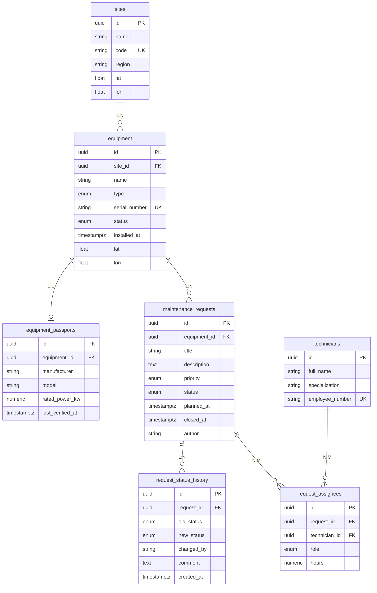

Программа для учёта заявок на техническое обслуживание оборудования производственной площадки (ветропарк).

## Описание

Сервис ведёт:

- Справочник оборудования — единицы с типом, серийным номером, координатами и статусом.
- Заявки на обслуживание — с жизненным циклом new → in_progress → done / rejected.
- Прогноз погоды — по координатам объекта, с признаком пригодности окна для наружных работ.

## Стек

- Node.js 18+, Express 5
- Sequelize 6 + pg + pg-hstore
- PostgreSQL 14 (Docker)
- Zod (валидация), Pino (логи), sequelize-cli (миграции и сиды)

## Требования

- Node.js 18.0.0 или выше
- npm 9.0.0 или выше

Сервер запускается на  http://localhost:3000.

## Переменные окружения

 PORT -  Порт сервера: 3000 
 NODE_ENV - Окружение: development 
 LOG_LEVEL  Уровень логирования: info 
 CORS_ORIGINS  Разрешённые origin через запятую 
 RATE_LIMIT_WINDOW_MS - Окно rate limit (мс):  60000 
 RATE_LIMIT_MAX - Максимум запросов:  100 
 WEATHER_API_URL - URL погодного API  
 REQUEST_TIMEOUT_MS - Таймаут внешнего API:  5000 
 WIND_THRESHOLD_MS - Порог ветра для работ:  10 

## Эндпоинты
# Health
GET /api/health — проверка доступности сервиса

# Equipment
GET /api/equipment — список оборудования (фильтры, сортировка, пагинация)

POST /api/equipment — создание единицы оборудования

GET /api/equipment/:id — карточка оборудования

PATCH /api/equipment/:id — частичное обновление

DELETE /api/equipment/:id — удаление (запрещено при открытых заявках)

GET /api/equipment/:id/requests — заявки по конкретному оборудованию

GET /api/equipment/:id/weather — прогноз по координатам и пригодность окна для наружных работ

# Requests
GET /api/requests — список заявок (фильтры, сортировка, пагинация)

POST /api/requests — создание заявки

GET /api/requests/:id — карточка заявки

PATCH /api/requests/:id — редактирование полей заявки

PATCH /api/requests/:id/status — смена статуса с проверкой допустимости перехода

DELETE /api/requests/:id — удаление заявки

POST /api/requests/:id/assignees — назначение бригады

DELETE /api/requests/:id/assignees/:userId — снятие специалиста

GET /api/requests/:id/history — история статусов

# Sites
GET /api/sites/:id/summary — сводка по площадке

# Reports
GET /api/reports/equipment-load — нагрузка на оборудование (raw SQL)

## Бизнес-правила

- Смена статуса — в одной транзакции (заявка и журнал).
- Назначение бригады — в одной транзакции, ровно один "lead", иначе 422.
- in_progress без исполнителей: 409.
- Удаление оборудования с заявками: 409.
- UNIQUE(request_id, technician_id) на уровне БД.

## Модель данных
# Equipment
id — string: UUID, генерируется сервером

name — string: 3–100 символов, обязательное

type — enum: turbine / inverter / sensor / substation

serialNumber — string: уникальный в системе

location — object: { lat: -90…90, lon: -180…180 }

status — enum: operational / maintenance / fault / decommissioned

installedAt — ISO-дата: не в будущем

createdAt — ISO-дата: проставляется сервером

updatedAt — ISO-дата: проставляется сервером

# Maintenance Request
id — string: UUID, генерируется сервером

equipmentId — string: UUID существующего оборудования

title — string: 5–120 символов, обязательное

description — string: до 2000 символов, опционально

priority — enum: low / medium / high / critical

status — enum: new / in_progress / done / rejected (по умолчанию new)

plannedAt — ISO-дата-время: опционально

createdAt — ISO-дата-время: проставляется сервером

updatedAt — ISO-дата-время: проставляется сервером

## База данных

DB_HOST - Хост PostgreSQL: 127.0.0.1
DB_PORT - Порт PostgreSQL: 5434
DB_NAME - Имя БД: equipment
DB_USER - Пользователь: equipment
DB_PASSWORD - Пароль: equipment
DB_POOL_MAX - Максимум соединений в пуле: 10
DB_LOGGING - Логировать SQL: false

Схема создаётся только миграциями. `sync({ force: true })` запрещён, поскольку удаляет существующие таблицы и все данные, не оставляет истории изменений схемы.
## Сиды

npm run seed                         # наполнить
npx sequelize-cli db:seed:undo:all   # откатить

Наполняют БД: 2 площадки, 6 ед. оборудования, 6 паспортов, 5 специалистов, 20 заявок, история статусов, назначения.

## Схема базы данных

### ER-диаграмма

### Связи и нормализация

Связи между таблицами:

- Площадка и оборудование: один ко многим, внешний ключ `site_id` в таблице `equipment`.
- Оборудование и паспорт: один к одному, отдельная таблица с уникальным внешним ключом `equipment_id`.
- Оборудование и заявки: один ко многим, внешний ключ `equipment_id` в таблице `maintenance_requests`.
- Заявка и история статусов: один ко многим, внешний ключ `request_id`, таблица append-only без поля `updated_at`.
- Заявки и специалисты: многие ко многим через таблицу `request_assignees` с полями `role` и `hours`.

Схема приведена к третьей нормальной форме:

- Первая нормальная форма: все значения атомарны, координаты хранятся в отдельных полях `lat` и `lon`.
- Вторая нормальная форма: в таблице `request_assignees` поля `role` и `hours` зависят от пары `(request_id, technician_id)`, а не от одного ключа.
- Третья нормальная форма: справочные значения (типы, статусы, приоритеты, роли) вынесены в PostgreSQL ENUM-типы, паспорт оборудования вынесен в отдельную таблицу, потому что он опционален и не участвует в основных выборках, журнал статусов вынесен в отдельную append-only таблицу.

### Правила ON DELETE

- `equipment.site_id` ссылается на `sites`, при удалении площадки: `SET NULL` (оборудование остаётся без площадки).
- `equipment_passports.equipment_id` ссылается на `equipment`, при удалении оборудования: `CASCADE` (паспорт не существует без оборудования).
- `maintenance_requests.equipment_id` ссылается на `equipment`, при удалении оборудования: `RESTRICT` (нельзя удалить оборудование, у которого есть заявки).
- `request_status_history.request_id` ссылается на `maintenance_requests`, при удалении заявки: `CASCADE` (журнал удаляется вместе с заявкой).
- `request_assignees.request_id` ссылается на `maintenance_requests`, при удалении заявки: `CASCADE` (назначения удаляются вместе с заявкой).
- `request_assignees.technician_id` ссылается на `technicians`, при удалении специалиста: `RESTRICT` (нельзя удалить специалиста, назначенного на заявки).

### Сводка по площадке

Эндпоинт: `GET /api/sites/:id/summary`.

Возвращает:

- `byStatus` — количество заявок в разрезе статусов.
- `byPriority` — количество заявок в разрезе приоритетов.
- `avgCloseHours` — среднее время от создания до закрытия заявки, в часах.

Реализация: `JOIN`, `GROUP BY` и `AVG(EXTRACT(EPOCH FROM (closed_at - created_at)) / 3600)`.

### Нагрузка на оборудование

Эндпоинт: `GET /api/reports/equipment-load?from=...&to=...&minRequests=...`.

Параметры (все опциональны):

- `from` — начало периода по `created_at` заявок, ISO-дата.
- `to` — конец периода, ISO-дата.
- `minRequests` — минимальное число заявок, фильтр `HAVING`.

Возвращает по каждой единице оборудования:

- `total_requests` — общее число заявок.
- `closed_requests` — число закрытых заявок.
- `planned_hours` — суммарные плановые трудозатраты.
- `last_service_date` — дата последнего обслуживания.

Запрос написан на прямом SQL: `JOIN`, `GROUP BY`, `HAVING`, `FILTER` и агрегатные функции. Все параметры передаются через `replacements`, конкатенации пользовательского ввода в текст запроса нет.