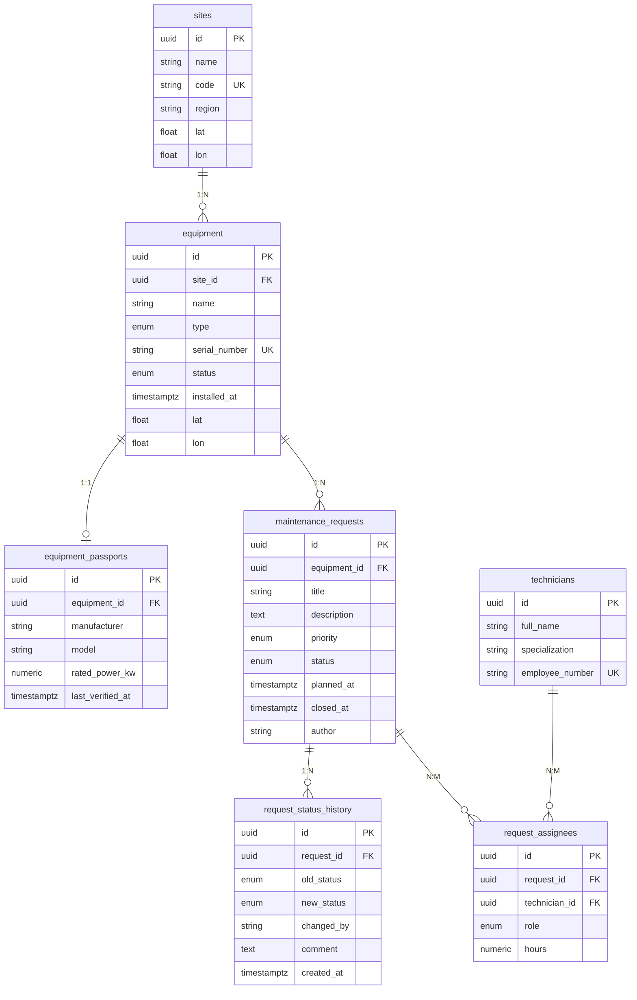

Программа для учёта заявок на техническое обслуживание оборудования производственной площадки (ветропарк).

## Описание

Сервис ведёт:

- Справочник оборудования — единицы с типом, серийным номером, координатами и статусом.
- Заявки на обслуживание — с жизненным циклом new → in_progress → done / rejected.
- Прогноз погоды — по координатам объекта, с признаком пригодности окна для наружных работ.

## Стек

- Node.js 18+, Express 5
- Sequelize 6 + pg + pg-hstore
- PostgreSQL 14 (Docker)
- Zod (валидация), Pino (логи), sequelize-cli (миграции и сиды)

## Требования

- Node.js 18.0.0 или выше
- npm 9.0.0 или выше

Сервер запускается на  http://localhost:3000.

## Переменные окружения

Приложение:
PORT=3000
NODE_ENV=development
LOG_LEVEL=info
CORS_ORIGINS=http://localhost:5173,http://localhost:3001
RATE_LIMIT_WINDOW_MS=60000
RATE_LIMIT_MAX=100
WEATHER_API_URL=https://api.open-meteo.com/v1/forecast
REQUEST_TIMEOUT_MS=5000
WIND_THRESHOLD_MS=10


База данных:
DB_HOST=127.0.0.1
DB_PORT=5434
DB_NAME=equipment
DB_USER=equipment
DB_PASSWORD=equipment
DB_POOL_MAX=10
DB_LOGGING=false
DB_NAME_TEST=equipment_test

Аутентификация:
JWT_ACCESS_SECRET=change-me-access-secret
JWT_REFRESH_SECRET=change-me-refresh-secret
JWT_ACCESS_TTL=15m
JWT_REFRESH_TTL=7d
BCRYPT_ROUNDS=10
COOKIE_SECURE=false
COOKIE_SAMESITE=lax
TRUST_PROXY=1
LOGIN_RATE_LIMIT_WINDOW_MS=60000
LOGIN_RATE_LIMIT_MAX=10

Мониторинг:
GRAFANA_ADMIN_USER=admin
GRAFANA_ADMIN_PASSWORD=admin

## Эндпоинты
# Health
GET /api/health/live — жизнеспособность процесса
GET /api/health/ready — готовность, включая доступность БД

# Equipment
GET /api/equipment — список оборудования (фильтры, сортировка, пагинация)

POST /api/equipment — создание единицы оборудования

GET /api/equipment/:id — карточка оборудования

PATCH /api/equipment/:id — частичное обновление

DELETE /api/equipment/:id — удаление (запрещено при открытых заявках)

GET /api/equipment/:id/requests — заявки по конкретному оборудованию

GET /api/equipment/:id/weather — прогноз по координатам и пригодность окна для наружных работ

# Requests
GET /api/requests — список заявок (фильтры, сортировка, пагинация)

POST /api/requests — создание заявки

GET /api/requests/:id — карточка заявки

PATCH /api/requests/:id — редактирование полей заявки

PATCH /api/requests/:id/status — смена статуса с проверкой допустимости перехода

DELETE /api/requests/:id — удаление заявки

POST /api/requests/:id/assignees — назначение бригады

DELETE /api/requests/:id/assignees/:userId — снятие специалиста

GET /api/requests/:id/history — история статусов

# Sites
GET /api/sites/:id/summary — сводка по площадке

# Reports
GET /api/reports/equipment-load — нагрузка на оборудование (raw SQL)

## Бизнес-правила

- Смена статуса — в одной транзакции (заявка и журнал).
- Назначение бригады — в одной транзакции, ровно один "lead", иначе 422.
- in_progress без исполнителей: 409.
- Удаление оборудования с заявками: 409.
- UNIQUE(request_id, technician_id) на уровне БД.

## Модель данных
# Equipment
id — string: UUID, генерируется сервером

name — string: 3–100 символов, обязательное

type — enum: turbine / inverter / sensor / substation

serialNumber — string: уникальный в системе

location — object: { lat: -90…90, lon: -180…180 }

status — enum: operational / maintenance / fault / decommissioned

installedAt — ISO-дата: не в будущем

createdAt — ISO-дата: проставляется сервером

updatedAt — ISO-дата: проставляется сервером

# Maintenance Request
id — string: UUID, генерируется сервером

equipmentId — string: UUID существующего оборудования

title — string: 5–120 символов, обязательное

description — string: до 2000 символов, опционально

priority — enum: low / medium / high / critical

status — enum: new / in_progress / done / rejected (по умолчанию new)

plannedAt — ISO-дата-время: опционально

createdAt — ISO-дата-время: проставляется сервером

updatedAt — ISO-дата-время: проставляется сервером

## База данных

DB_HOST - Хост PostgreSQL: 127.0.0.1
DB_PORT - Порт PostgreSQL: 5434
DB_NAME - Имя БД: equipment
DB_USER - Пользователь: equipment
DB_PASSWORD - Пароль: equipment
DB_POOL_MAX - Максимум соединений в пуле: 10
DB_LOGGING - Логировать SQL: false

Схема создаётся только миграциями. `sync({ force: true })` запрещён, поскольку удаляет существующие таблицы и все данные, не оставляет истории изменений схемы.
## Сиды


npm run seed                         # наполнить
npx sequelize-cli db:seed:undo:all   # откатить

Наполняют БД: 2 площадки, 6 ед. оборудования, 6 паспортов, 5 специалистов, 20 заявок, история статусов, назначения.

## Схема базы данных

### ER-диаграмма



### Связи и нормализация

Связи между таблицами:

- Площадка и оборудование: один ко многим, внешний ключ `site_id` в таблице `equipment`.
- Оборудование и паспорт: один к одному, отдельная таблица с уникальным внешним ключом `equipment_id`.
- Оборудование и заявки: один ко многим, внешний ключ `equipment_id` в таблице `maintenance_requests`.
- Заявка и история статусов: один ко многим, внешний ключ `request_id`, таблица append-only без поля `updated_at`.
- Заявки и специалисты: многие ко многим через таблицу `request_assignees` с полями `role` и `hours`.

Схема приведена к третьей нормальной форме:

- Первая нормальная форма: все значения атомарны, координаты хранятся в отдельных полях `lat` и `lon`.
- Вторая нормальная форма: в таблице `request_assignees` поля `role` и `hours` зависят от пары `(request_id, technician_id)`, а не от одного ключа.
- Третья нормальная форма: справочные значения (типы, статусы, приоритеты, роли) вынесены в PostgreSQL ENUM-типы, паспорт оборудования вынесен в отдельную таблицу, потому что он опционален и не участвует в основных выборках, журнал статусов вынесен в отдельную append-only таблицу.

### Правила ON DELETE

- `equipment.site_id` ссылается на `sites`, при удалении площадки: `SET NULL` (оборудование остаётся без площадки).
- `equipment_passports.equipment_id` ссылается на `equipment`, при удалении оборудования: `CASCADE` (паспорт не существует без оборудования).
- `maintenance_requests.equipment_id` ссылается на `equipment`, при удалении оборудования: `RESTRICT` (нельзя удалить оборудование, у которого есть заявки).
- `request_status_history.request_id` ссылается на `maintenance_requests`, при удалении заявки: `CASCADE` (журнал удаляется вместе с заявкой).
- `request_assignees.request_id` ссылается на `maintenance_requests`, при удалении заявки: `CASCADE` (назначения удаляются вместе с заявкой).
- `request_assignees.technician_id` ссылается на `technicians`, при удалении специалиста: `RESTRICT` (нельзя удалить специалиста, назначенного на заявки).


### Сводка по площадке

Эндпоинт: `GET /api/sites/:id/summary`.

Возвращает:

- `byStatus` — количество заявок в разрезе статусов.
- `byPriority` — количество заявок в разрезе приоритетов.
- `avgCloseHours` — среднее время от создания до закрытия заявки, в часах.

Реализация: `JOIN`, `GROUP BY` и `AVG(EXTRACT(EPOCH FROM (closed_at - created_at)) / 3600)`.

### Нагрузка на оборудование

Эндпоинт: `GET /api/reports/equipment-load?from=...&to=...&minRequests=...`.

Параметры (все опциональны):

- `from` — начало периода по `created_at` заявок, ISO-дата.
- `to` — конец периода, ISO-дата.
- `minRequests` — минимальное число заявок, фильтр `HAVING`.

Возвращает по каждой единице оборудования:

- `total_requests` — общее число заявок.
- `closed_requests` — число закрытых заявок.
- `planned_hours` — суммарные плановые трудозатраты.
- `last_service_date` — дата последнего обслуживания.

Запрос написан на прямом SQL: `JOIN`, `GROUP BY`, `HAVING`, `FILTER` и агрегатные функции. Все параметры передаются через `replacements`, конкатенации пользовательского ввода в текст запроса нет.

## Postman

В репозитории две коллекции:

- `docs/postman/collection.json` + `docs/postman/environment.json` — коллекция Кейса 2.
- `postman_collection.json` (в корне) — коллекция Кейса 3: те же и новые эндпоинты(assignees, history, sites summary, reports) и негативные сценарии (404, 409, 422).

## Аутентификация и роли

### Роли и права

- `viewer` — чтение справочников, заявок, истории и отчётов.
- `technician` — права `viewer`, плюс создание и редактирование заявок и смена статуса заявок, на которые он назначен.
- `admin` — все операции, включая управление оборудованием, площадками, специалистами, назначение бригад и удаление записей.

Изменяющие запросы требуют access-токена. Без токена возвращается 401, при недостатке прав — 403.

### Эндпоинты аутентификации

- `POST /api/auth/register` — регистрация, роль по умолчанию `viewer`.
- `POST /api/auth/login` — вход, выдача access-токена и установка refresh-cookie.
- `POST /api/auth/refresh` — обновление access-токена по refresh-cookie.
- `POST /api/auth/logout` — выход, удаление refresh-cookie.
- `GET /api/auth/me` — текущий пользователь и его роль.

### Токены и cookie

- Пароли хранятся в виде bcrypt-хеша. Хеши и пароли не попадают в ответы API и логи.
- Access-токен подписывается секретом `JWT_ACCESS_SECRET`, срок действия 15 минут (`JWT_ACCESS_TTL`).
- Refresh-токен передаётся в cookie `refresh_token` с флагами `HttpOnly`, `Secure`, `SameSite=Lax`, путь `/api/auth`. Срок действия 7 дней (`JWT_REFRESH_TTL`).
- `SameSite=Lax` выбран для схемы, когда UI и API находятся на одном домене за Nginx. В продакшене при HTTPS можно выставить `SameSite=Strict` и `COOKIE_SECURE=true`.
- Эндпоинт входа защищён отдельным rate limit: 10 попыток в минуту. Сообщение об ошибке одинаково для несуществующего пользователя и неверного пароля.

## Стек развёртывания


Все сервисы описаны в `docker-compose.yml`, поднимаются одной командой. Снаружи опубликован только порт 80. `api` и `postgres` доступны только внутри docker-сети `backend`.

- **Nginx** — обратный прокси. Конфигурация в `deploy/nginx/`. Проксирует `/api/` и `/api/docs` на `api:3000`, `/grafana/` на `grafana:3000`, `/prometheus/` на `prometheus:9090`, `/metrics` закрыт по IP. Передаёт заголовки `Host`, `X-Real-IP`, `X-Forwarded-For`, `X-Forwarded-Proto`. В приложении включён `trust proxy`.
- **api** — Node.js-приложение. Образ собирается многоступенчато (`Dockerfile`): сначала prod-зависимости, затем код в чистый образ, запуск не под root.
- **postgres** — PostgreSQL 14, том `pgdata`.
- **prometheus** — собирает метрики с `/metrics` каждые 15 секунд. Правила алертов в `deploy/prometheus/alerts.yml`.
- **grafana** — дашборд и алерты. Provisioning из `deploy/grafana/`.


## Миграции

Схема создаётся только миграциями. `sync({ force: true })` запрещён: он удаляет таблицы и данные, не оставляет истории изменений.

```bash
npm run migrate
npm run migrate:undo
npm run migrate:undo:all
```

Полный цикл «применить -> откатить -> применить» проходит без ошибок.

При развёртывании через Docker Compose миграции и сиды применяются автоматически сервисом `migrate` — отдельная команда не нужна.

## Мониторинг

Метрики Prometheus на `/metrics`: количество запросов по маршрутам и кодам ответа, длительность обработки, количество ошибок 4xx и 5xx, стандартные метрики Node.js (CPU, память).

- `GET /api/health/live` — жизнеспособность процесса.
- `GET /api/health/ready` — готовность, включая доступность БД.

Prometheus и Grafana поднимаются в составе стека, datasource и дашборд подключаются автоматически из файлов в `deploy/`.

### Технические панели

- RPS по маршрутам.
- Доля ответов 4xx и 5xx.
- Время ответа p95 и p50.
- Доступность сервиса.
- CPU и память api.

### Прикладные панели

- Заявки по статусам.
- Заявки по приоритетам.
- Среднее время закрытия заявки.
- Нагрузка на оборудование.

Дашборд хранится в `deploy/grafana/dashboards/api-overview.json`, появляется при развёртывании с нуля.

### Оповещения

В `deploy/prometheus/alerts.yml` два правила:

- `ApiHigh5xxRate` — доля ответов 5xx выше 5% за 5 минут, держится 2 минуты.
- `ApiDown` — Prometheus не может достучаться до `/metrics` более 1 минуты.

Порядок при срабатывании:

1. Grafana -> Alerting -> Alert rules — определить, какой алерт в `Firing`.
2. Открыть дашборд «Equipment API — Overview», посмотреть панели «Доля ответов 4xx и 5xx», «Время ответа», «Доступность».
3. Логи api: `docker compose logs api --tail 100`.
4. Проверить готовность: `docker compose exec api wget -qO- http://127.0.0.1:3000/api/health/ready`.
5. После устранения причины алерт вернётся в `Inactive`.

## Тесты

```bash
npm test
npm run test:cov
```

- Модульные тесты: переходы статусов заявки, правила назначения бригады.
- Интеграционные тесты: регистрация, вход, `/me`, доступ без токена (401), доступ с недостаточными правами (403), конфликты (409).
- 4 тестовых набора, 16 тестов. Все проходят.
- Внешние сервисы в тестах не вызываются.

### Изоляция тестов

Тесты используют **отдельную базу данных** `equipment_test`, а не рабочую `equipment`. Это гарантирует, что данные рабочей БД не изменяются при прогоне тестов.

Тестовая БД создаётся **один раз** перед первым запуском:

```bash
docker start equipment-db
docker exec -it equipment-db psql -U equipment -d equipment -c "CREATE DATABASE equipment_test;"

# применить миграции на тестовую БД
$env:NODE_ENV='test'
npx sequelize-cli db:migrate
$env:NODE_ENV='development'
```

Дальше при каждом запуске `npm test`:

- `tests/env.js` (подключён через `setupFiles` в `jest.config.js`) до импорта Sequelize выставляет `NODE_ENV=test` и `DB_NAME=equipment_test`.
- `tests/setup.js` перед каждым тестом делает `TRUNCATE` всех таблиц тестовой БД.
- После всех тестов Sequelize закрывает соединение.

Проверить, что рабочая БД не затрагивается:

```bash
docker exec -it equipment-db psql -U equipment -d equipment -c "SELECT COUNT(*) FROM users;"
npm test
docker exec -it equipment-db psql -U equipment -d equipment -c "SELECT COUNT(*) FROM users;"
```

Число пользователей до и после `npm test` одинаковое.

## Алгоритм развёртывания (для проверки)

### С нуля на чистой машине

```bash
git clone https://github.com/Star-Raven-Galaxy/Case2.git
cd Case2
Copy-Item .env.example .env       # Windows; в Linux/macOS: cp .env.example .env
docker compose up -d
```

### Что происходит при `docker compose up -d`

1. Поднимается `postgres`, ждёт `healthy`.
2. Запускается `migrate` — применяет миграции и сиды, завершается с кодом 0.
3. Запускается `api` после успешного завершения `migrate`.
4. Запускаются `nginx`, `prometheus`, `grafana`.

Ждать 20–30 секунд, пока `equipment-api` и `equipment-postgres` станут `(healthy)`.

### Проверка

```bash
docker compose ps
docker compose exec api wget -qO- http://127.0.0.1:3000/api/health/ready
```

Ожидаемо: `{"status":"ready","db":"up","timestamp":"..."}`.

### Адреса

- API через Nginx: `http://localhost/api/health/live`
- Swagger UI: `http://localhost/api/docs`
- Prometheus: `http://localhost/prometheus/`

## Архитектурные решения

- Слоистая архитектура: routes → controllers → services → repositories → models. Контроллеры не работают с Sequelize, сервисы не работают с `req`/`res`. При переходе с файлового хранилища на PostgreSQL в Кейсе 3 контроллеры и сервисы не менялись.
- Внешний контракт API сохраняется между кейсами. Ошибки в едином формате `{ error: { code, message, requestId, details? } }`.
- Транзакции используются для многотабличных операций: смена статуса заявки и запись в журнал; назначение бригады. Внутри транзакции строка заявки блокируется (`SELECT ... FOR UPDATE`).
- Прямые SQL-запросы параметризованы через `replacements`. Поля сортировки и направления проверяются по белому списку. `limit` ограничен сверху.
- Аутентификация: JWT access и refresh в HttpOnly cookie. Секреты в переменных окружения. Пароли — bcrypt.
- `/metrics` доступен только из docker-сети. UI Grafana и Prometheus — через Nginx.

## Известные ограничения

- `COOKIE_SECURE=false` по умолчанию для локального HTTP. В продакшене за HTTPS выставляется `true`.
- Nginx слушает только HTTP (80). HTTPS не настроен.
- Grafana использует пароль по умолчанию `admin`. В продакшене меняется.
- Прикладные панели Grafana читают данные из PostgreSQL. При недоступной БД они не отрисовываются, технические панели (из Prometheus) продолжают работать.
- Logout очищает refresh-cookie, но не инвалидирует уже выданный refresh-токен. Для отзыва нужен отдельный механизм (jti + таблица `refresh_tokens`).

## Развёртывание и проверка

Требования: Docker Desktop запущен, терминал открыт в корне проекта.

### 1. Развернуть стек

```powershell
docker stop equipment-db -ErrorAction SilentlyContinue
docker compose down -v
Copy-Item .env.example .env -ErrorAction SilentlyContinue
docker compose up -d
Start-Sleep -Seconds 25
docker compose ps
```

Ожидается: `equipment-postgres` и `equipment-api` в статусе `(healthy)`, остальные — `Up`. Миграции и сиды применяются автоматически сервисом `equipment-migrate`.

### 2. Проверить готовность

```powershell
docker compose exec api wget -qO- http://127.0.0.1:3000/api/health/ready
```

Ожидается: `{"status":"ready","db":"up","timestamp":"..."}`.

### 3. Проверить, что данные загружены

```powershell
docker exec -i equipment-postgres psql -U equipment -d equipment -c "SELECT 'sites' AS t, COUNT(*) FROM sites UNION ALL SELECT 'equipment', COUNT(*) FROM equipment UNION ALL SELECT 'requests', COUNT(*) FROM maintenance_requests UNION ALL SELECT 'users', COUNT(*) FROM users;"
```

Ожидаемо: sites=2, equipment=6, requests=20, users=3.

### 4. Проверить авторизацию

```powershell
$body = @{ email = "admin@example.com"; password = "Passw0rd!" } | ConvertTo-Json
$login = Invoke-RestMethod -Uri "http://localhost/api/auth/login" -Method Post -ContentType "application/json" -Body $body
$token = $login.data.accessToken
Invoke-RestMethod -Uri "http://localhost/api/auth/me" -Headers @{ Authorization = "Bearer $token" }
```

Ожидаемо: объект пользователя `admin@example.com` без `passwordHash`.

### 5. Прогнать тесты

```powershell
docker start equipment-db
docker exec -i equipment-db psql -U equipment -d equipment -c "CREATE DATABASE equipment_test;" 2>$null
$env:NODE_ENV='test'
npx sequelize-cli db:migrate
$env:NODE_ENV='development'
npm test
```

Ожидается: `Test Suites: 4 passed`, `Tests: 16 passed`. Тесты используют отдельную БД `equipment_test`, рабочая не затрагивается.

### 6. Открыть интерфейсы

- Swagger UI: `http://localhost/api/docs`
- Grafana: `http://localhost/grafana/`, логин `admin`, пароль `admin`
- Prometheus: `http://localhost/prometheus/targets`, target `api:3000` в статусе `UP`
- Prometheus Alerts: `http://localhost/prometheus/alerts`, алерты `ApiHigh5xxRate` и `ApiDown` в статусе `Inactive`

### 7. Остановить

```powershell
docker compose down
```

Данные в томах сохраняются. Полный сброс — `docker compose down -v`.


